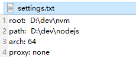
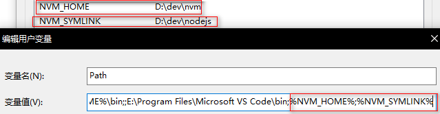
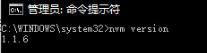
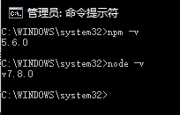

# NVM工具的使用

> Node Version Manager（Node版本管理工具）

window安装操作步骤：

1、卸载掉系统中已经存在的所有node.js版本

2、下载安装包 [nvm-windows](https://github.com/coreybutler/nvm-windows/releases/download/1.1.0/nvm-noinstall.zip)

3、解压到一个全英文路径

4、解压后目录下默认有`settings.txt`文件，如没有则手动创建

- `root 配置为当前 nvm.exe 所在目录`
- `path 配置为 node 快捷方式所在的目录`
- `arch 配置为当前操作系统的位数（32/64）`
- `proxy 不用配置`

如图所示：

  

5、双击nvm-setup.exe安装，注意修改安装路径

6、配置环境变量

- `NVM_HOME = 当前 nvm.exe 所在目录`
- `NVM_SYMLINK = node 快捷方式所在的目录`
- `PATH 追加 %NVM_HOME%;%NVM_SYMLINK%;`
- 打开CMD通过`set [name]`命令查看环境变量是否配置成功
- PowerShell中是通过`dir env:[name]`命令

 

7、检查nvm安装成功

在cmd中输入：`nvm varsion` 检查版本号，出现下图既成功

 

## 在window下使用nvm安装node.js

1、列出全部可以安装的版本号

`nvm list available` 

或去网站查看：https://github.com/coreybutler/nodedistro/blob/master/nodeversions.json

2、安装node.js

`nvm install <版本号>` 

这里的安装命令其实会自动去下载两个文件：Nodejs.exe和npm包

3、查看是否安装好

`nvm list` 查看当前所有安装好的node.js版本

卸载

`nvm uninstall <版本号>` 

4、使用node.js

`nvm use <版本号>`  切换到使用指定的版本，再次查看版本前面会带*号

5、检查

  

